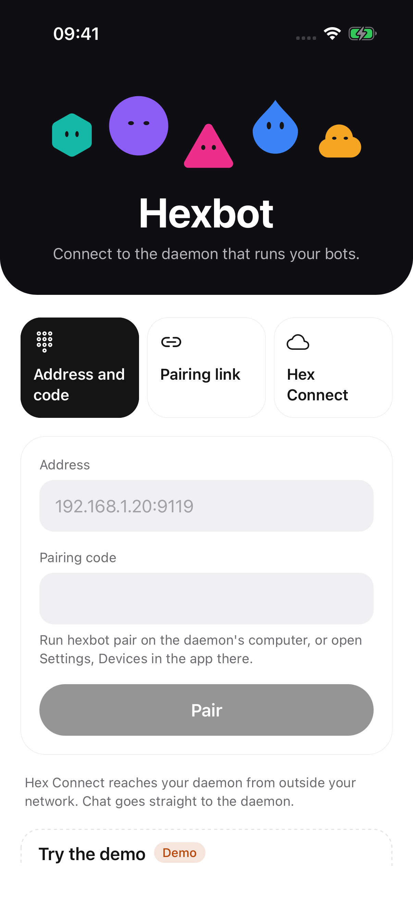
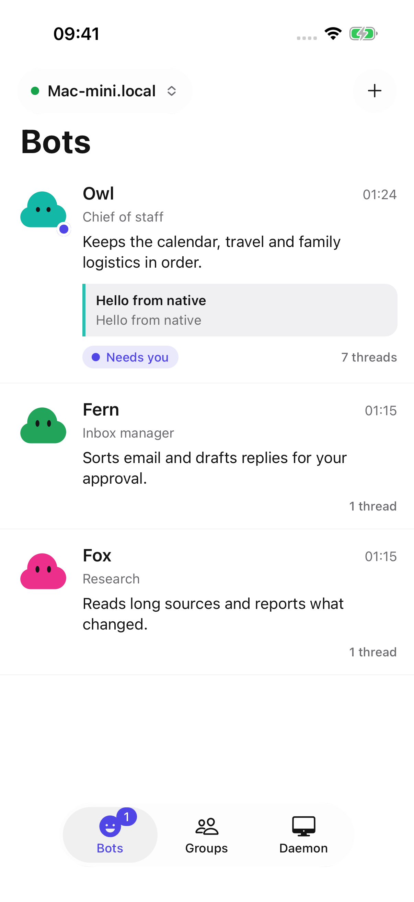
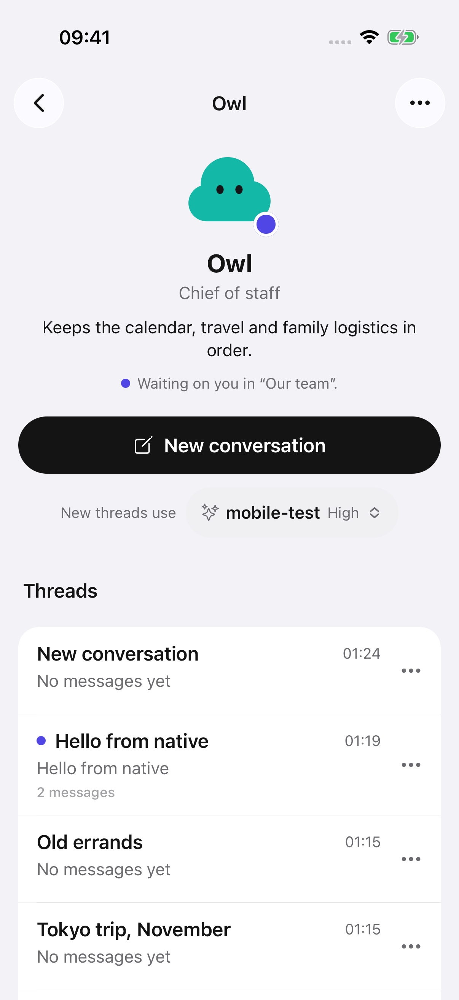
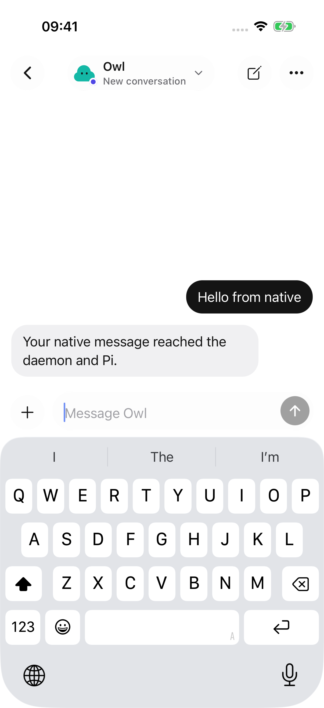
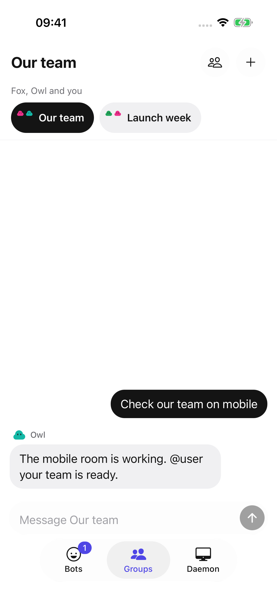
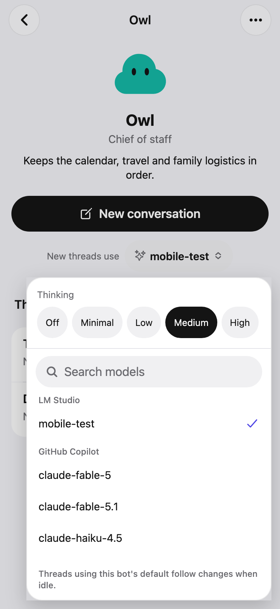
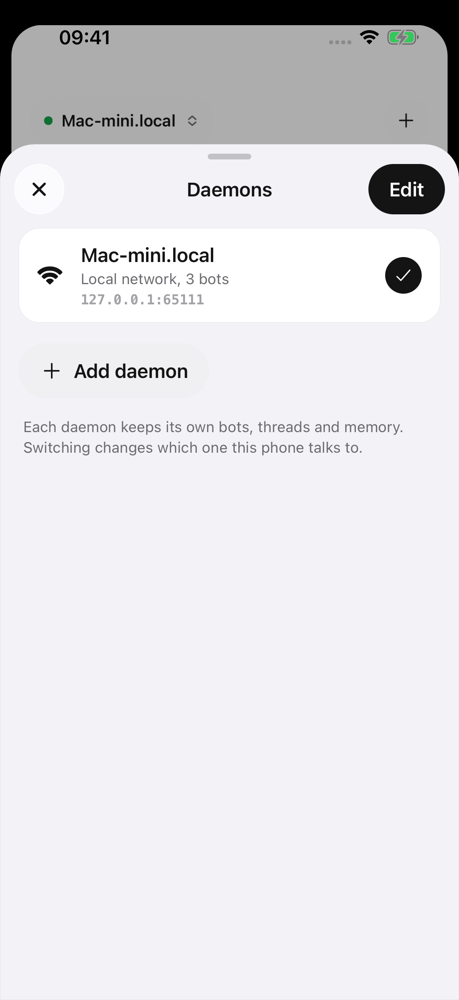
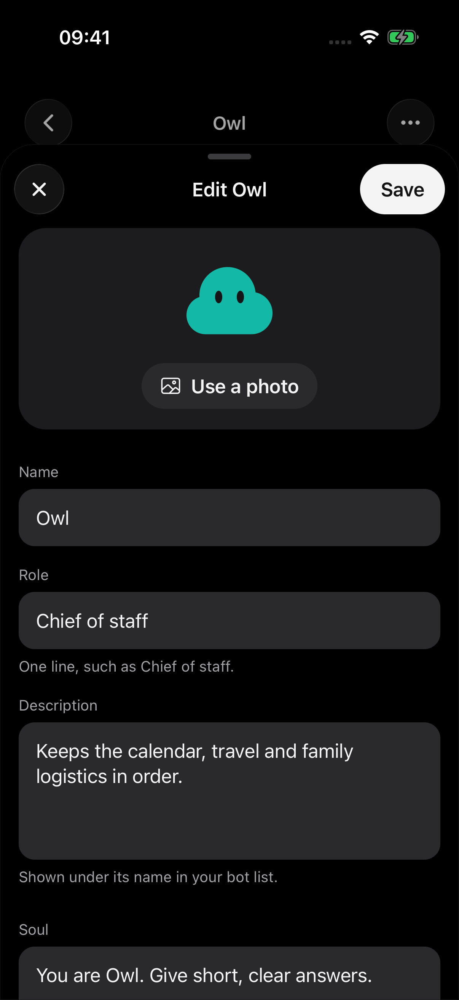
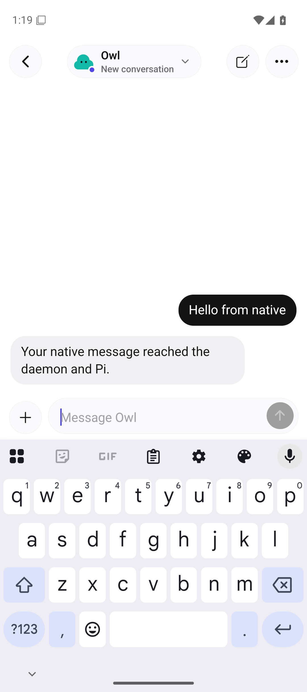
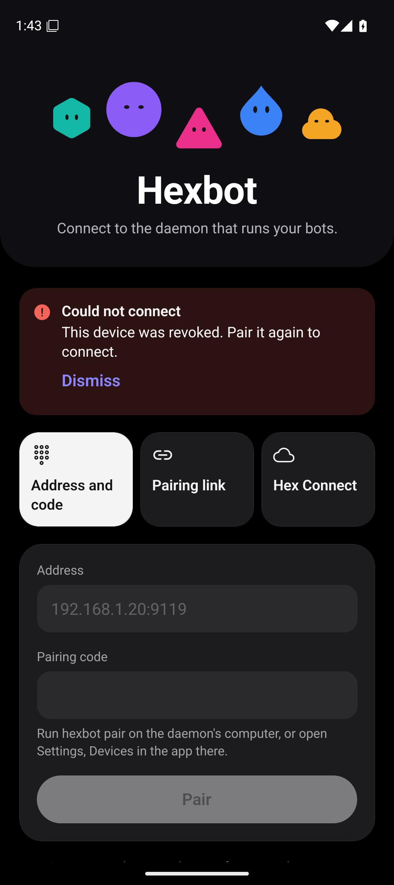

# Hexbot mobile screenshots

Captured from the Expo development app on 2026-10-08 with the current JavaScript
bundle. iOS uses an iPhone 17 Pro simulator running iOS 26.5. Android uses an
arm64 emulator running Android 16, API 36. These are running app screens.
The model menu image comes from the web integration check after aligning the
app with the current daemon reasoning API.

The app paired with a disposable Rust daemon and the pinned Pi runtime. A local
streaming model fixture supplied replies. Native checks covered pairing, new
threads, sending messages, the keyboard, nested cards, saved drafts, model
menus, light and dark appearance, and device revocation on Android. The iOS
checks also covered management panels and sandboxed visuals.

| Connect | Bots | Threads |
| --- | --- | --- |
|  |  |  |

| Chat | Groups | Model menu |
| --- | --- | --- |
|  |  |  |

| Daemon switcher | Profile in dark appearance |
| --- | --- |
|  |  |

| Android chat | Android revoked device |
| --- | --- |
|  |  |

See [the mobile README](../../../apps/mobile/README.md) and
[testing instructions](../../testing.md) to reproduce the checks. CI uploads
the web integration screenshots and report as the `mobile-evidence` artifact.
Physical devices and production Hex Connect sign-in remain manual checks.
